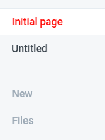

# Initial page

## Getting Super Powers

Becoming a super hero is a fairly straight forward process:

```groovy
$ give me super-powers
```


 Super-powers are granted randomly so please submit an issue if you're not happy with yours.


Once you're strong enough, save the world:


```bash
# Ain't no code for that yet, sorry
echo 'You got to trust me on this, I saved the world'
```


`echo 'You got to be kidding me.'` 😄 

Hi 

Hello

How are you?

This is an update with the previous version.


Adding this line.


There is no page limit here.

We can just go on and on.

## Titles

## aslfkjas;fljaslfjsdlfjsdljsg

### sldkfjldkffjdalsg;kja;slgkjlfkjas;lkfjas;lkj

#### sldfkjslfjsdlgjsdlgjslgjdslgjsdlgjdslgj


## Text Formatting

This is trail for **bold**.

This is trail for _italic_

This is trail for ~~strikethrough~~

~~~~

## Code Blocks



```bash
echo $PATH
```



```python
print ("Hello World!")
```

`echo $PATH`

`print ("Hello World!")`

```This is a code```

```text

```

\`\`

```javascript
print ("Hello World!")
```

```bash
echo $PATH

```

This is how it's done then.


Got the hang of it.




* This is point one.
* This is point two.
* * This is 1st branch.
  * * 2nd branch.
    * 1. 3rd branch
      2. 3rd sub branch.
      3. * daflkj
         * lasfkdfsd
         * 

We came out of this. Just keep hitting enter.

-\[\]

* [ ] This is a list
* [ ] We can use this as a checkmark.

## All this we did above is by using a markup language.


> ### This is a quote
>
> You need to follow this to have any sense of what is going on.

Just hit enter to come out of it.


## This is quite amazing, I am enjoying this.


## Hints and Callouts


FYI

This is something very important to keep in mind.


```bash

```



This is the first tab.



This is the second tab.



























```

```





## This is some crazy stuff. Loving this.



| Column 1 | Column 2 |
| :--- | :--- |
| Difference 1 | Difference 2 |
| Haha | Hehe |


